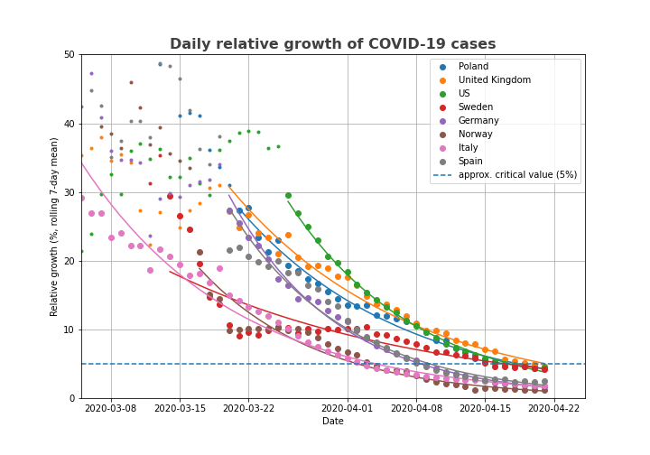
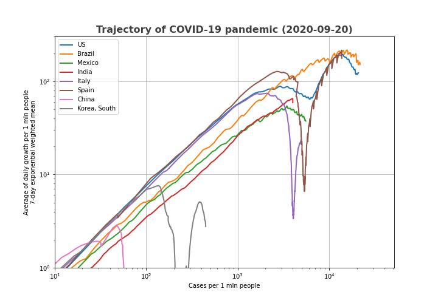

# My COVID-19 data experiments

Feel free to use these examples any way you like according to Creative Commons License. You can experiment with this using binder, just click the icon above. 

## Examples
The relative growth rate plot shows the dynamics of the suppression efforts particularly well.

An the trajectory inspired by https://aatishb.com/covidtrends/ shows the clear signal when each country finally beats the spread of the virus. 

