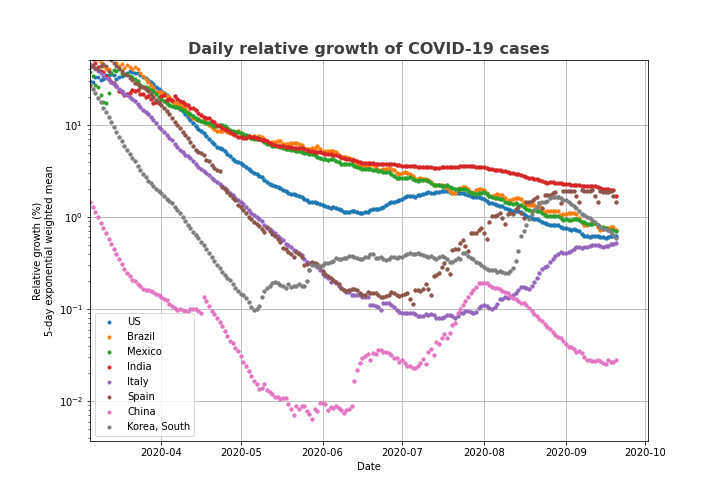

## My COVID-19 data experiments

Feel free to use these examples any way you like according to Creative Commons License.
The relative growth rate plot shows the dynamics of the suppression efforts particularly well.

You can experiment with this using binder: 
